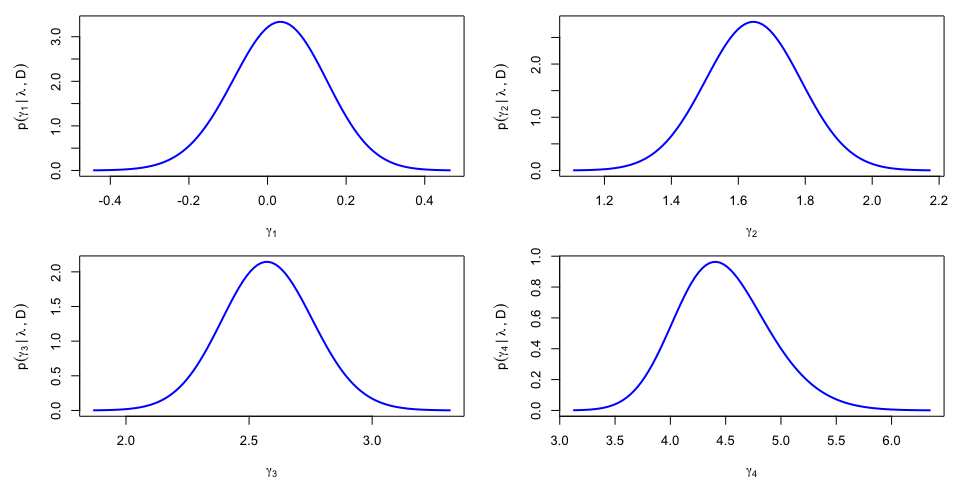

The *ordgam* R-package
================

The **ordgam** package enables to fit an additive proportional odds
model to ordinal data.

The combination of **Laplace approximations** and of **Bayesian
P-splines** (named *LPS*) enable fast and flexible inference in a
Bayesian framework. The Gaussian Markov field prior assumed for the
penalized spline parameters and the Bernstein-von Mises theorem
typically provide reliable Laplace approximation to the posterior
distribution of these quantities. However, this accuracy can be
seriously compromised for some unpenalized parameters, especially when
the information synthesized by the prior and the likelihood is sparse.

We propose a refined version of the LPS methodology by splitting the
parameter space in two subsets,
$\pmb{\zeta}=(\pmb{\gamma}^\top,\pmb{\theta}^\top)^\top$ . The first set
involves the non-penalized parameters $\pmb{\gamma}$ for which the joint
posterior distribution $p(\pmb{\gamma}|\pmb{\lambda},{\cal D})$ is
approached from a non-Gaussian perspective with an approximation scheme
tailored to capture asymmetry and kurtosis, while the conditional
posterior distribution
$p(\pmb{\theta}|\pmb{\gamma},\pmb{\lambda},{\cal D})$ for the penalized
parameters $\pmb{\theta}$ in the complementary set undergoes the LPS
treatment with Laplace approximations, see Fig.1 (with
$\pmb{\eta}=\pmb{\lambda}$).

The marginal posterior density $p(\pmb{\nu}|{\cal D})$ for the log of
the penalty parameters, $\pmb{\nu}=\log(\pmb{\lambda})$, also could be
approximated using a product of skew-t densities. More details can be
found in Lambert & Gressani (2022)
[\[1\]](https://arxiv.org/abs/2210.01668).

<figure>

<figcaption>
Fig.1: Proposed strategy to account for skewness and kurtosis in the
posterior of the non-penalized parameters.
</figcaption>
</figure>

## The *ordgam* package in action

Let us illustrate the use of the *ordgam* package on a data subset
($n=552$) from the European Social Survey (ESS 2018) specific to the
French speaking respondents from Wallonia, one of the three regions in
Belgium. Each of the participants (aged at least 15) was asked to react
to the following statement, *Gay men and lesbians should be free to live
their own life as they wish*, with a positioning on a Likert scale going
from 1 (*Agree strongly*) to 5 (*Disagree strongly*).

``` r
    ## Package installation and loading
    ## install.packages("devtools")
    ## devtools::install_github("plambertULiege/ordgam")
    library(ordgam) 
    
    ## Data reading
    data(freehmsDataBE)
    donnees = subset(freehmsDataBE,region=="WAL") ## Focus on Wallonia
    head(donnees)
```

    ##    freehms   gndr age eduyrs region
    ## 2        1   Male  25     17    WAL
    ## 3        2 Female  76      6    WAL
    ## 7        1   Male  69     17    WAL
    ## 9        2   Male  36     10    WAL
    ## 12       1   Male  54      7    WAL
    ## 18       1 Female  28     14    WAL

### Model fitting

Let us fit a proportional odds model to these data with the number of
completed years of education ($14.1\pm 4.4$ years) and age
($47.3\pm 18.5$ years) entering as additive terms, $L=10$ recentered
B-splines spanning each covariate range, and Gamma priors for the
penalty parameters, $\lambda_j\sim{\cal G}(1,10^{-4})$ ($j=1,2$).

``` r
    ## Model fit with a Gamma prior for the penalty parameters
    mod = ordgam(freehms ~ s(eduyrs) + s(age), data=donnees, descending = FALSE) 
    print(mod)                                  
```

    ## Call:
    ##  ordgam(formula = freehms ~ s(eduyrs) + s(age), data = donnees,      descending = FALSE) 
    ## 
    ## Prior set on the regression paramaters <beta>
    ## 
    ## Parameter estimation:
    ##       est      se     low      up     Z   Pval    
    ## 1  0.0272  0.1152 -0.1986  0.2530  0.24   0.81    
    ## 2  1.6318  0.1400  1.3574  1.9062 11.66 <2e-16 ***
    ## 3  2.5509  0.1863  2.1858  2.9160 13.69 <2e-16 ***
    ## 4  4.4168  0.4163  3.6008  5.2328 10.61 <2e-16 ***
    ## 
    ## Approximate significance of smooth terms:
    ##            edf    Tr     Pval  Chi2    Pval    
    ## f(eduyrs) 1.24  1.01 0.477617  1.15 0.35501    
    ## f(age)    2.55 18.77 0.000265 18.82 0.00017 ***
    ## 
    ## Selected penalty parameters <lambda>:  191.7967 18.40125 
    ## Lambda log prior:  dgamma(lambda, 1, 1e-04, log = TRUE)
    ## 
    ## Likelihood - Information criterions (n = 552):
    ##      edf     logL logLmarg      AIC      BIC 
    ##     7.79  -598.66  -606.75  1212.90  1246.49 
    ## 
    ## NOTE: model the odds of a response value in the lower scale

The estimated additive terms can also be visualized:

``` r
    plot(mod, mfrow=c(1,2))
```

<figure>

</figure>

### Asymmetric posterior for the non-penalized parameters

The asymmetry of the posterior for the non-penalized parameters
$\pmb{\gamma}$ can be visualized. The first step in the approach
requires the projection of $\pmb{\gamma}$ on the eigenvectors of the
variance-covariance matrix $\Sigma_\lambda^{\gamma\gamma}$, yielding
$\tilde{\pmb{\gamma}}$ and its approximately independent components. The
posterior density $p(\tilde\gamma_k|\lambda,{\cal D})$ is further
approximated using a skew-t density, revealing a non-negligible
asymmetry for the posterior of $\tilde\gamma_1$ (corresponding to the
direction of the eigenvector with the largest eigenvalue):

``` r
    model = mod  ## Model for which the approximation is required
    
    ## Skew-t approximation to the marginal of gamma.tilde[k]
    ngamma = with(model, nalpha+nfixed)  ## Number of non-penalized parms
    gamt.ST = list()  ## Skew-t coefs --> dst(x,dp=coef)
    for (k in 1:ngamma){ ## Loop over the gamma.tilde components
        x.grid = seq(-4,4,length=10)  ## Grid of values for gamma.tilde[k]
        lfy.grid = ordgam::lmarg.gammaTilde(x.grid,k=k,model)  ## log p(gamma.tilde[k] | D)
        gamt.ST[[k]] = ordgam:::STapprox(x.grid,lfy.grid)$dp  ## Approximate using a skew-t
    }
    
    ## Visualization of the posterior for <gamma.tilde[k]>
    par(mfrow=c(2,2),mar=c(4,5,1,1))
    for (k in 1:ngamma){ ## Loop over the gamma.tilde components
        xlab = bquote(tilde(gamma)[.(k)])
        ylab = bquote(p(tilde(gamma)[.(k)]~ "|"~lambda~","~D))
        xlim = sn::qst(c(.0001,.9999),dp=gamt.ST[[k]])
        curve(sn::dst(x,dp=gamt.ST[[k]]), xlim=xlim,
              xlab=xlab,ylab=ylab,col="blue",lwd=2,lty=1) 
    }
```


The results can be re-expressed in the original parametrization, yieding
$p(\gamma_k|\lambda,{\cal D})$ and a noticable asymmetry for the
posterior density of $\gamma_4$:

``` r
    ## Sampling <gamma.tilde> using the (approximate) independence of its components
    M = 10000
    sample.tilde = matrix(nrow=M,ncol=ngamma)
    for (k in 1:ngamma){
        ## ... or using skew-t approximation
        sample.tilde[,k] = c(sn::rst(M, dp=gamt.ST[[k]]))
    }
    
    ## Revert sample to the original <gamma> parametrization
    gam.hat = model$theta[1:ngamma]  ## MAP estimate
    Sig = model$Sigma.theta[1:ngamma,1:ngamma] ## Variance-covariance
    sv = svd(Sig) ; V = sv$u ; omega = sv$d  ## SVD
    sample.gam = t(gam.hat + V %*% (sqrt(omega) * t(sample.tilde)))
    
    ## Skew-t approximation to the marginal of gam[k]
    gam.ST = gam.ST2 = list()
    for (k in 1:ngamma){
        temp = hist(sample.gam[,k],plot=FALSE)
        gam.ST[[k]] = ordgam:::STapprox(temp$mids,log(temp$density+1e-6))$dp
        ## temp = selm(sample.gam[,k] ~ 1, family="ST")
        ## gam.ST2[[k]] = coef(temp,"DP")
    }
    
    ## Visualize p(gamma[k] | lambda,data)
    par(mfrow=c(2,2),mar=c(4,5,1,1))
    for (k in 1:ngamma){
        xlab = bquote(gamma[.(k)])
        ylab = bquote(p(gamma[.(k)]~ "|"~lambda~","~D))
        xlim = sn::qst(c(.0001,.9999),dp=gam.ST[[k]])
        curve(sn::dst(x,dp=gam.ST[[k]]), lwd=2,col="blue",
              xlim=xlim, xlab=xlab, ylab=ylab)
    }
```



### Marginal posterior of the penalty parameters

Let us revisit the same model for the data collected in Flanders, the
most populated region of Belgium.

``` r
## Model fit with a Gamma prior for the penalty parameters
mod.FL = ordgam(freehms ~ s(eduyrs) + s(age), data=subset(freehmsDataBE,region=="FL"), 
                descending = FALSE) 
print(mod.FL)
```

    ## Call:
    ##  ordgam(formula = freehms ~ s(eduyrs) + s(age), descending = FALSE,
    ##         data = subset(freehmsDataBE, region == "FL")) 
    ## 
    ## Prior set on the regression paramaters <beta>
    ## 
    ## Parameter estimation:
    ##      est     se    low     up     Z    Pval    
    ## 1 0.3176 0.0866 0.1479 0.4872  3.67 0.00024 ***
    ## 2 2.7105 0.1367 2.4426 2.9784 19.83 < 2e-16 ***
    ## 3 3.4898 0.1829 3.1312 3.8484 19.08 < 2e-16 ***
    ## 4 4.8852 0.3407 4.2174 5.5530 14.34 < 2e-16 ***
    ## 
    ## Approximate significance of smooth terms:
    ##            edf   Tr     Pval Chi2    Pval    
    ## f(eduyrs) 1.15 27.7 9.64e-07 29.0 1.0e-07 ***
    ## f(age)    2.57 34.6 1.41e-06 34.6 7.9e-08 ***
    ## 
    ## Selected penalty parameters <lambda>:  296.6694 33.87409 
    ## Lambda log prior:  dgamma(lambda, 1, 1e-04, log = TRUE)
    ## 
    ## Likelihood - Information criterions (n = 1046):
    ##      edf     logL logLmarg      AIC      BIC 
    ##     7.72  -923.13  -932.09  1861.70  1899.94 
    ## 
    ## NOTE: model the odds of a response value in the lower scale

``` r
fhat.FL = plot(mod.FL, mfrow=c(1,2))
```


The estimated additive terms for education and age look a bit different
from the estimates for Wallonia with, here, the suggestion of a
statistically significant and linear effect of 'eduyrs'.

The marginal posterior distribution of the log of the penalty
parameters, $\mu_j=\log\lambda_j$, can be visualized and compared to the
their prior:

``` r
  model = mod.FL
  ## log(lambda) marginal posteriors
  par(mfrow=c(1,2),mar=c(4,5,3,1))
  for (j in 1:2){ ## Loop over <nu> components
    ## Plot of the approximating skew-t for <nu[j]>
    xlims = sn::qst(c(.001,.999),dp=model$nu.dp[[j]])
    xlab = bquote(log(lambda[.(j)]))
    ylab = bquote(p(log(lambda[.(j)])~ "|"~D))
    curve(sn::dst(x,dp=model$nu.dp[[j]]),xlims[1],xlims[2],lwd=2,col="red",
          main=names(model$lambda)[j],xlab=xlab,ylab=ylab,ylim=c(0,.4))
    ## ... compared to the prior for <nu[j]>
    curve(exp(model$lprior.lambda(exp(x)))*exp(x),add=T,lty=3,lwd=2)
    legend("topright", legend=c("Posterior","Prior"),
           lwd=c(2,2), lty=c(1,3), col=c("red","black"),
           horiz=TRUE, bty="n",cex=1)
  }
```


While the first posterior associated to penalty parameter for ‘eduyrs’
does not depart from its prior with a large prior mean (as
$\lambda_1 \sim {\cal G}(1,10^{-4})$ has prior mean $10^4$) and suggests
linearity, the posterior associated to $\nu_2=\log(\lambda_2)$ suggests a
non-linear effect of ‘age’ by pointing to smaller values for the penalty
parameter.

## License

**ordgam**: Additive proportional odds model for ordinal data using
Laplace approximations and Bayesian P-splines. Copyright (C) 2022-2023
Philippe Lambert

This program is free software: you can redistribute it and/or modify it
under the terms of the GNU General Public License as published by the
Free Software Foundation, either version 3 of the License, or (at your
option) any later version.

This program is distributed in the hope that it will be useful, but
WITHOUT ANY WARRANTY; without even the implied warranty of
MERCHANTABILITY or FITNESS FOR A PARTICULAR PURPOSE. See the GNU General
Public License for more details.

You should have received a copy of the GNU General Public License along
with this program. If not, see <https://www.gnu.org/licenses/>.

## References

\[1\] Lambert, P. and Gressani, O (2022). Penalty parameter selection
and asymmetry corrections to Laplace approximations in Bayesian
P-splines models. [*arXiv:2210.01668*](https://arxiv.org/abs/2210.01668)

\[2\] Lambert, P. (2023) R-package *ordgam* - GitHub:
[plambertULiege/ordgam](https://github.com/plambertULiege/ordgam)
